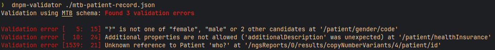
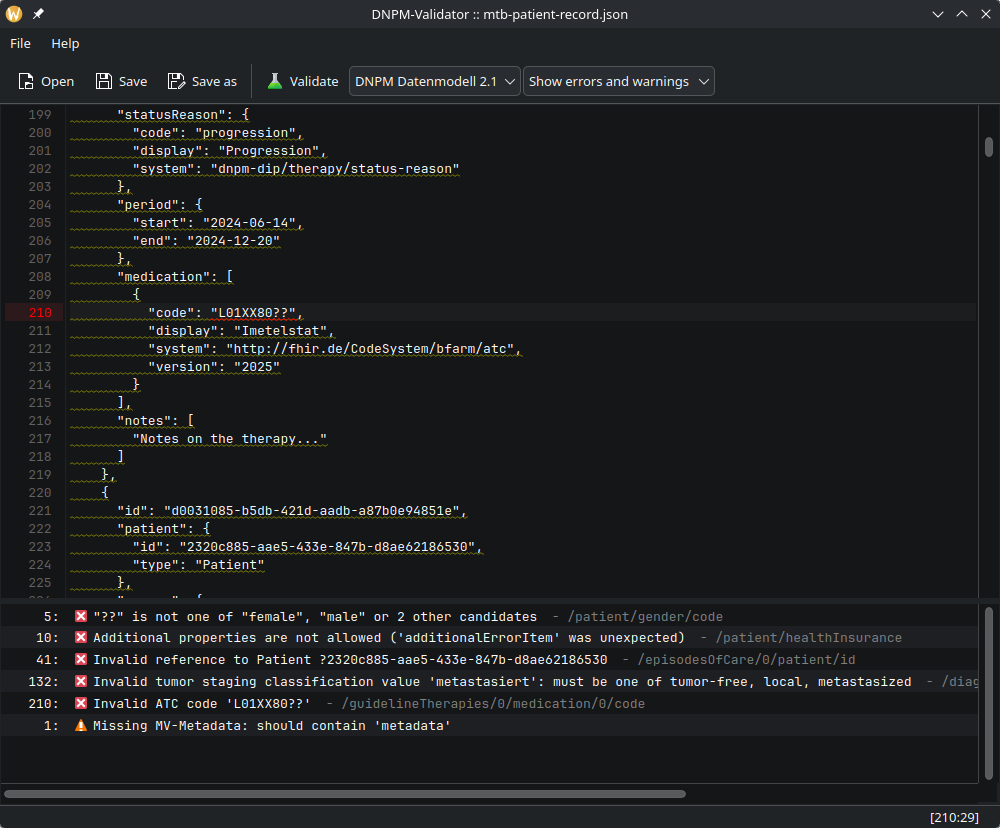

# DNPM Validator

Application to validate a data set in DNPM Datenmodell 2.1, SE:dip data model and GRZ Metadata format

## Usage

```
Usage: dnpm-validator [OPTIONS] <FILE>

Arguments:
  <FILE>  The file to be checked

Options:
      --type <SCHEMA>  The schema to be used [default: mtb] [possible values: mtb, rd, grz]
  -h, --help           Print help
  -V, --version        Print version
```

The following schema types are available for validation:

* `mtb`: DNPM-Datenmodell 2.1
* `rd`: RD:dip Datenmodell
* `grz`: GRZ Metadata 1.3.1



This project also provides a desktop UI frontend to validate and edit DNPM/SE:dip JSON files.



## Implemented validations

| Validation                           | MTB | RD | GRZ |
|--------------------------------------|-----|----|-----|
| JSON-Schema                          | ☑  | ☑ | ☑  |
| Diagnosis references                 | ☑  | ☑ | -   |
| Patient references                   | ☑  | ☑ | -   |
| Recommendation references            | ☑  | ☑ | -   |
| Claim references                     | ☑  | ☑ | -   |
| Therapy references                   | ☑  | ☑ | -   |
| Medication recommendation references | ☑  | -  | -   |
| Therapy recommendation references    | -   | ☑ | -   |
| ATC codes                            | ☑  | ☑ | -   |
| Required tumor staging category      | ☑  | -  | -   |
| MV metadata (warning if missing)     | ☑  | ☑ | -   |

JSON-Schema validation for *MTB* and *RD* is based on a more common JSON-Schema format than the one provided by DNPM:
DIP. Any occurrences of type references like `#Reference` have been replaced with e.g. `#/$defs/Reference` to make the
validation work. JSON-Schema validation for *GRZ*
uses [GRZ JSON-Schema 1.3.1 available on GitHub](https://github.com/BfArM-MVH/MVGenomseq_GRZ/blob/v1.3.1/GRZ/grz-schema.json).